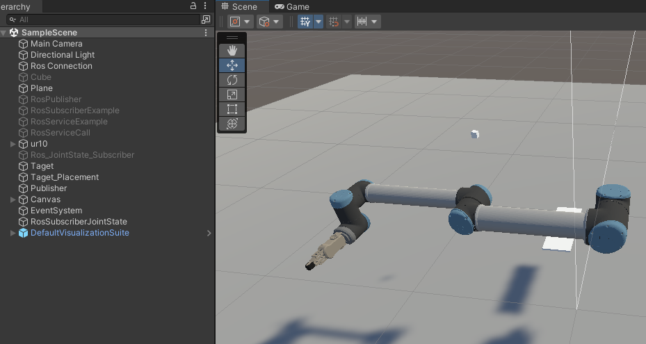

# Unity and UR Digital Twin Application based on ROS (*Project under development*)

[](https://opensource.org/licenses/Apache-2.0)
[](https://opensource.org/licenses/BSD-3-Clause)

This repository contains a collection of ROS packages and a Unity package, which shows the basic example of communication between Unity and a UR10e robot throughout the ROS connection. 
Please check the two demonstrations videos following:

___Demo1: Unity control UR robot by publishing the joint position control signal___   
[](https://www.youtube.com/watch?v=s2j93Ihb4DU&t=2s)

___Demo2: The UR robot publishes /joint_state topic to Unity___
[](https://www.youtube.com/watch?v=X9TOy9JnVtA)|

## 1.Installation: 
___1.1 Install Universal Robot ROS driver___ 

https://github.com/UniversalRobots/Universal_Robots_ROS_Driver

___1.2 Following steps to setup the ROS_Unity_Integration___

https://github.com/Unity-Technologies/Unity-Robotics-Hub/tree/main/tutorials/ros_unity_integration

___1.3 Following Moveit Tutorial___

https://ros-planning.github.io/moveit_tutorials/doc/move_group_python_interface/move_group_python_interface_tutorial.html
https://moveit.ros.org/documentation/concepts/

___1.4 Gitclone and building ```unit_universal_robot``` ROS package___

```
git clone https://github.com/TriKnight/unity_universal_robots
cd catkin_ws
catkin build
```


## 2.Usage with Gazebo Simulation 
There are launch files available to bringup a simulated robot - either UR5e or UR10e.  In the following the commands for the UR10e are given. For the UR5, simply replace the prefix accordingly.  

___2.1 To bring up the simulated robot in Gazebo, run:___

```roslaunch ur_gazebo ur10e_bringup.launch```


___2.2 MoveIt! with a simulated robot___  

Again, you can use MoveIt! to control the simulated robot.  
For setting up the MoveIt! nodes to allow motion planning run:


```roslaunch ur10e_moveit_config ur10e_moveit_planning_execution.launch sim:=true```


___2.3 For starting up RViz with a configuration including the MoveIt! Motion Planning plugin run:___


```roslaunch ur10e_moveit_config moveit_rviz.launch```


## 3. MoveGroup example 
___3.1 Start RViz and MoveGroup node___

Open two shells. Start RViz and wait for everything to finish loading in the first shell:
```
roslaunch ur10e_moveit_config demo.launch
```

___3.2 Run the ```move_group_joint_state``` example___
This code will help the robot move by following joint state positions and desired points throughout ROS service
```
rosrun unity_universal_robots move_group_joint_state.py
```

## 4. Running Unity control UR10e Robot

___4.1. Running the ROS Driver, Robot_IP: ```<your_robot_IP>```___
```
roslaunch ur_robot_driver ur10e_bringup.launch robot_ip:=192.168.1.201 
```

___4.2. Running MoveIt planning on UR10e robot___
```
roslaunch ur10e_moveit_config ur10e_moveit_planning_execution.launch limited:=true 
```

___4.3. Nextstep running the Moveit! config with RViz view___
```
roslaunch ur10e_moveit_config moveit_rviz.launch
```

___4.4. Start Unity and Open the UR_ROS_Unity package in folder___



___4.5. Running the TCP/IP end point server___

>Note, By default, the server_endpoint will listen on ip 0.0.0.0 (i.e. allowing all incoming addresses) and port 10000, but these settings are configurable. To override them, you can change the command to ```roslaunch ros_tcp_endpoint endpoint.launch tcp_ip:=127.0.0.1 tcp_port:=10000``` (obviously replacing 127.0.0.1 with your desired IP and 10000 with your desired port number.)

```
roslaunch unity_universal_robots start_tcp_ip.launch
```

___4.6. Running the Joint State Position control___
```
rosrun unity_universal_robots pos_joints_control.py
```


